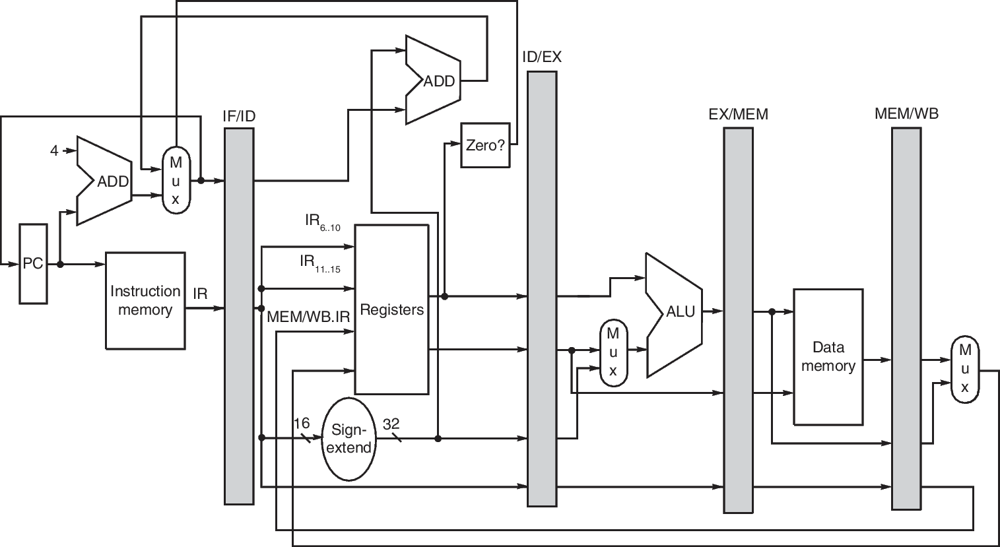
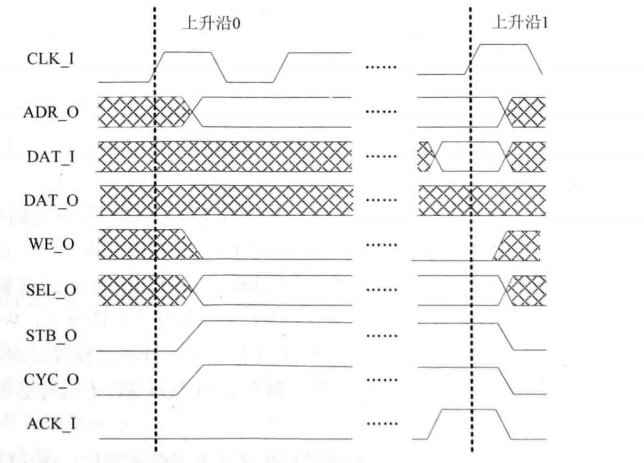

# 简介

这个cpu采用的是lkx的工作 http://os.cs.tsinghua.edu.cn/oscourse/OS2017spring/projects/u1

该cpu是经典的5级流水线架构，支持m态和s态特权级，并且具有mmu单元与tlb，无cache设计。

soc则基于《自己动手写CPU》(雷思磊)结构，采用的是wishbone总线，其中sdram使用的是开源代码，uart自己重写(为了节省资源，只支持发送功能，且只有一个端口，波特率写死，无ready位)，片外flash目前尚不清楚如何工作，故采用片内rom，使用intel的.hex文件进行例化。总线交互也采用的是开源代码，具体信息下面的各个小节。

## 五级流水架构

这只是一个简单的示意图，如果没有相关的基础知识理解起来还是比较困难的，我这里推荐一本书，名字是《计算机组成与设计——硬件软件接口》作者是Patterson和Hennessy，里面有详细的过于MIPS架构的介绍，事实上MIPS和RISCV从架构上讲都属于精简指令集，而且很多结构都比较相似，所以不必拘泥于一定要找riscv的书。另外如果接触源码的话，之前推荐的雷思磊写的是一本不错的书，不过学习过程不能只是抄源码，还是要多去理解才有更大的收获的。

在这里我结合本工程的CPU简单介绍一下一个指令的执行过程，对于一条指令来讲，在硬件执行的过程中被拆分成了5个阶段，这五个阶段在没有异常和暂停的时候是并行进行的。对于一个指令来说首先在IF阶段更新pc值并从指令ROM中取数据，这个时候由于数据可能需要若干周期，流水线就暂停了，等到请求完毕后将去回来的指令送往ID级，ID级的工作顾名思义就是decode的过程，接下来进入的是EXE也就是执行级，这里面一般会进行一些加减乘除移位的运算操作，然后将结果送往mem级，如果有访存的指令，那么就访问数据ram即可，同理，请求ram可能也需要多周期，此时流水线也停下。执行完毕后数据送往WB级，将结果写回寄存器堆。

需要注意的是，图中并没有标注处理中断异常的特权级，mips中是cp0，riscv中是csr，这个阶段一般都放在mem，一般来讲地址都需要进行mmu转换，一个访问ram的地址，需要先经过csr的一些判断，然后送往tlb，tlb出来的地址再送往(或者cache)内存。针对一些异常的情况，csr这个模块会及时地发出清流水线的命令，并进行相关处理。

> riscv的官方手册也是一个很好的帮助，另外国人也有一版电子书(翻译)介绍riscv架构的，在此也一并推荐 http://crva.io/documents/RISC-V-Reader-Chinese-v2p1.pdf

## wishbone总线

wishbone总线只考虑单次的读写还是比较简单的，上面的端口比如 `rst`, `clk` 大多可以顾名思义，在此我也不赘述，握手协议简单地说就是 **CYC和STB同时拉高时表示请求开始，在整个过程中，保持高电平，一直等到slave响应ACK拉高后的下一周期，CYC，STB和ACK拉低，至此一个请求结束** 这里给一个简单的时序图(来自《自己动手写CPU》)，不考虑TAG信号，更详细资料请参阅 https://cdn.opencores.org/downloads/wbspec_b4.pdf 

> 请注意上升沿1和上升沿0之间实际可能还有若干个周期，并且ACK拉高的那个周期的上升沿CYC和STB还是高电平

